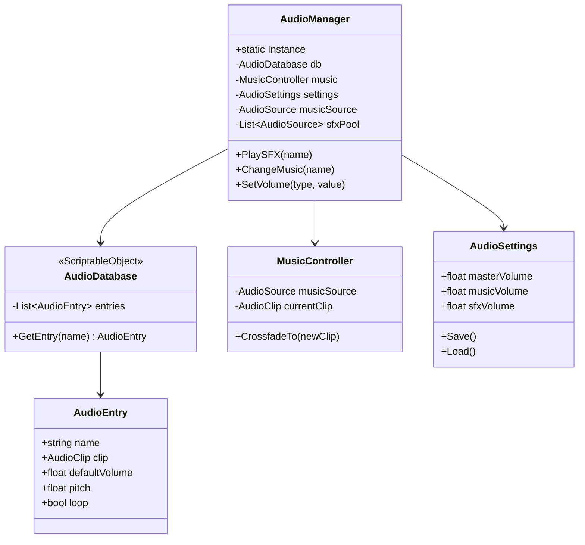

```mermaid
classDiagram
    class AudioManager {
        +static Instance
        -AudioDatabase db
        -MusicController music
        -AudioSettings settings
        -AudioSource musicSource
        -List~AudioSource~ sfxPool
        +PlaySFX(name)
        +ChangeMusic(name)
        +SetVolume(type, value)
    }

    class AudioDatabase {
        <<ScriptableObject>>
        -List~AudioEntry~ entries
        +GetEntry(name) AudioEntry
    }

    class MusicController {
        -AudioSource musicSource
        -AudioClip currentClip
        +CrossfadeTo(newClip)
    }

    class AudioEntry {
        +string name
        +AudioClip clip
        +float defaultVolume
        +float pitch
        +bool loop
    }

    class AudioSettings {
        +float masterVolume
        +float musicVolume
        +float sfxVolume
        +Save()
        +Load()
    }

    AudioManager --> AudioDatabase
    AudioManager --> MusicController
    AudioManager --> AudioSettings
    AudioDatabase --> AudioEntry
    
```