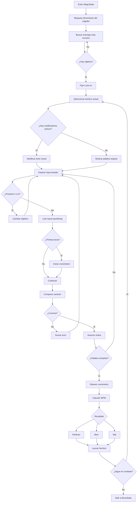

```mermaid
flowchart TD

A[Enter MagicState] --> B[Bloquear Movimiento del Jugador]
B --> C[Buscar enemigo más cercano]
C --> D{¿Hay objetivo?}

D -- No --> C
D -- Sí --> E[Fijar Lock-on]

E --> F[Seleccionar hechizo actual]
F --> G{¿Hay modificadores activos?}

G -- Sí --> H[Modificar texto visual]
G -- No --> I[Mostrar palabra original]

H --> J[Esperar input teclado]
I --> J

J --> K{¿Presionó 1,2,3?}

K -- Sí --> L[Cambiar objetivo]
L --> J

K -- No --> M[Leer Input.inputString]

M --> N{¿Primera tecla?}
N -- Sí --> O[Iniciar cronómetro]
N -- No --> P[Continuar]

O --> P

P --> Q[Comparar carácter]
Q --> R{¿Correcto?}

R -- No --> S[Sumar error] --> J
R -- Sí --> T[Avanzar índice]

T --> U{¿Palabra completa?}

U -- No --> J

U -- Sí --> V[Detener cronómetro]
V --> W[Calcular WPM]

W --> X{Resultado}

X --> Y[Perfecto]
X --> Z[Bien]
X --> AA[Mal]

Y --> AB[Lanzar hechizo]
Z --> AB
AA --> AB

AB --> AC{¿Sigue en combate?}

AC -- Sí --> F
AC -- No --> AD[Salir a MoveState]
```