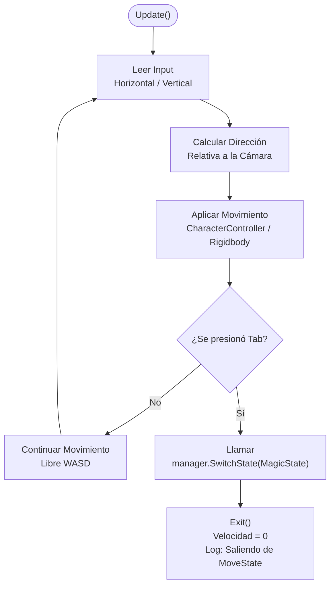

```mermaid
flowchart TD
    A(["Update()"])

    B["Leer Input<br/>Horizontal / Vertical"]

    C["Calcular Dirección<br/>Relativa a la Cámara"]

    D["Aplicar Movimiento<br/>CharacterController / Rigidbody"]

    E{"¿Se presionó Tab?"}

    F["Continuar Movimiento<br/>Libre WASD"]

    G["Llamar<br/>manager.SwitchState(MagicState)"]

    H["Exit()<br/>Velocidad = 0<br/>Log: Saliendo de MoveState"]

    A --> B
    B --> C
    C --> D
    D --> E

    E -- No --> F
    F --> B

    E -- Sí --> G
    G --> H
```