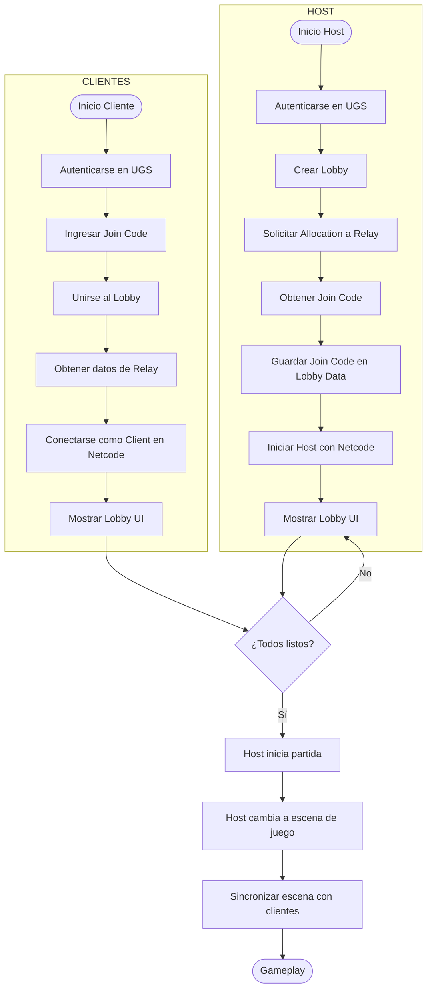

```mermaid
flowchart TD

%% HOST FLOW
subgraph HOST
A([Inicio Host]) --> B[Autenticarse en UGS]
B --> C[Crear Lobby]
C --> D[Solicitar Allocation a Relay]
D --> E[Obtener Join Code]
E --> F[Guardar Join Code en Lobby Data]
F --> G[Iniciar Host con Netcode]
G --> H[Mostrar Lobby UI]
end

%% CLIENT FLOW
subgraph CLIENTES
I([Inicio Cliente]) --> J[Autenticarse en UGS]
J --> K[Ingresar Join Code]
K --> L[Unirse al Lobby]
L --> M[Obtener datos de Relay]
M --> N[Conectarse como Client en Netcode]
N --> O[Mostrar Lobby UI]
end

%% READY CHECK
H --> P{¿Todos listos?}
O --> P

P -- No --> H
P -- Sí --> Q[Host inicia partida]

%% GAME START
Q --> R[Host cambia a escena de juego]
R --> S[Sincronizar escena con clientes]
S --> T([Gameplay])
```