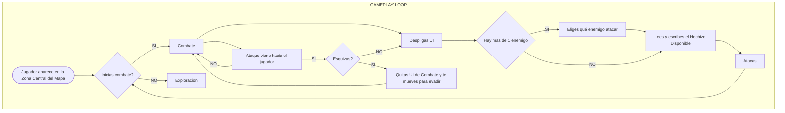

```mermaid
flowchart TD

%% GAMEPLAY LOOP FLOW
subgraph GAMEPLAY LOOP
A([Jugador aparece en la Zona Central del Mapa]) --> B{Inicias combate?}

B --SI--> C[Combate]
B --NO--> D[Exploracion]

C --> E[Despligas UI]
E --> F{Hay mas de 1 enemigo}
F --SI--> G[Eliges qué enemigo atacar]
G--> H
F --NO--> H[Lees y escribes el Hechizo Disponible]
H --> I[Atacas]
I-->B

C -->J[Ataque viene hacia el jugador]
J--SI-->K{Esquivas?}
J--NO-->C

K--SI-->L[Quitas UI de Combate y te mueves para evadir]
K--NO-->E
L-->C

end


```