# Diagramas — Typing Battle Royale

> Diagramas de flujo y secuencia generados por ingeniería inversa del proyecto Unity.
> Render: Mermaid (GitHub / VS Code Markdown Preview con extensión Mermaid).
> Fecha del análisis: 2026-05-06.

---

## 1. Diagrama de Flujo de Escenas (alto nivel)

Sólo 3 escenas están registradas en `ProjectSettings/EditorBuildSettings.asset`:
`LobbyScene` (índice 0, entry point), `CharacterSelect` (1), `GameplayScene` (2).
El resto son escenas huérfanas (test/legacy).

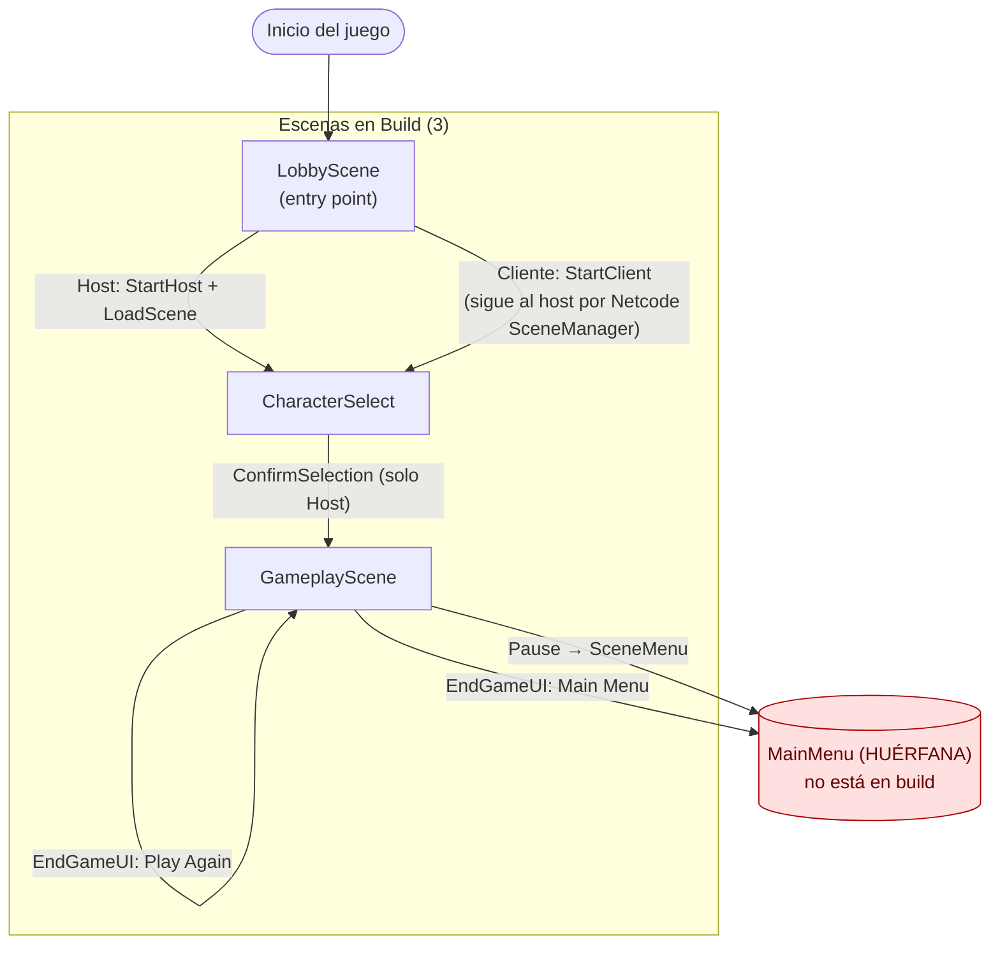

> **Hallazgo crítico:** los botones "Main Menu" del EndGame y de Pause apuntan a `MainMenu`, pero esa escena no está en build → la carga fallará en build de producción.

### Escenas huérfanas (no referenciadas en el flujo activo)

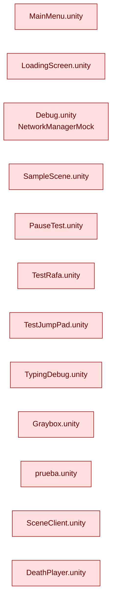

---

## 2. Diagrama de Secuencia — Flujo Multijugador (Host)

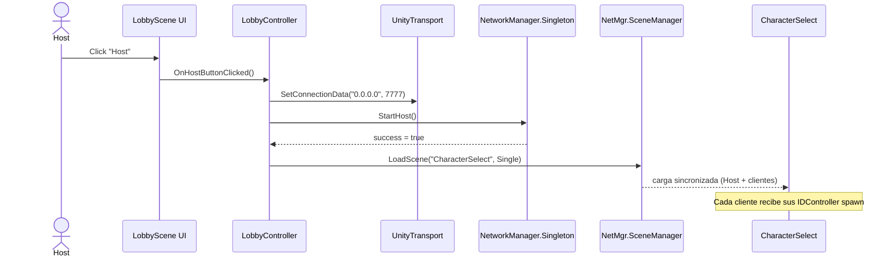

---

## 3. Diagrama de Secuencia — Flujo Multijugador (Cliente)

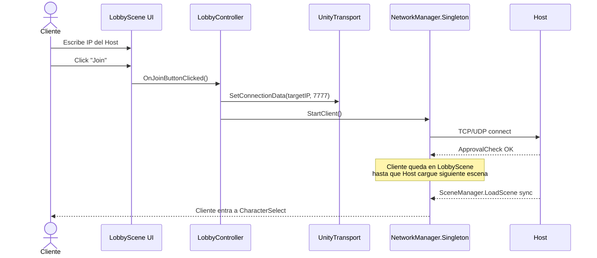

---

## 4. Diagrama de Secuencia — Selección de Personaje

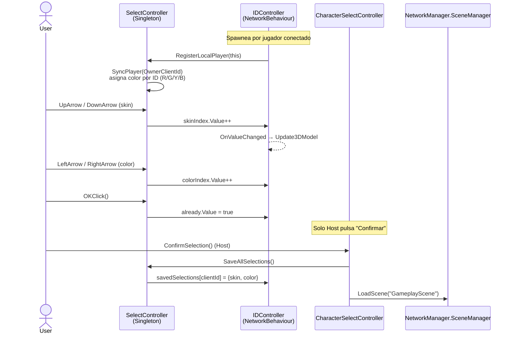

---

## 5. Diagrama de Secuencia — Spawn en GameplayScene

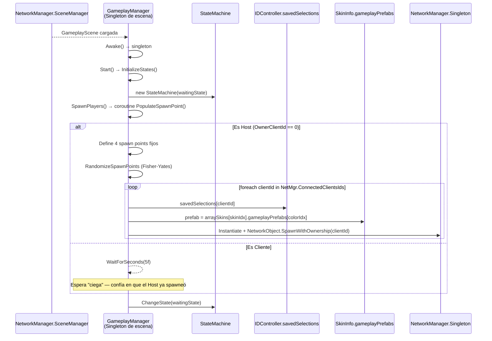

---

## 6. Diagrama de Estados — StateMachine de Gameplay

`GameplayManager` instancia los estados pero arranca en `waitingState`. `BattleState` es una sub-máquina paralela activada desde `PlayState` cuando el jugador presiona la tecla de cambio.

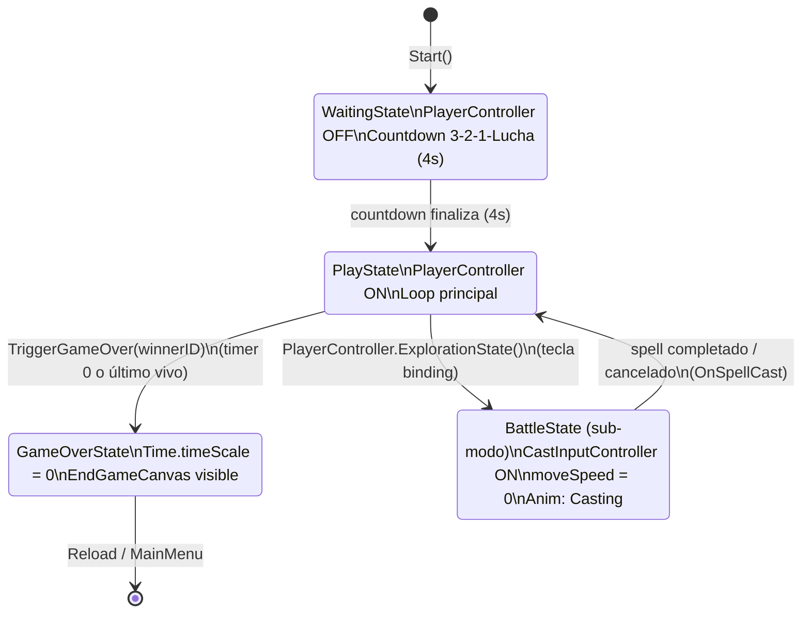

> **Nota:** existe también `ExplorationState` definido pero `GameplayManager` arranca en `waitingState` y nunca lo usa explícitamente. Hay una **StateMachine duplicada** en `GameManager.cs` (singleton DontDestroyOnLoad) que crea un `ExplorationState` pero su `Update()` se sobrescribe efectivamente al construir `GameplayManager`.

---

## 7. Diagrama de Secuencia — Casteo de Hechizo (Typing Combat)

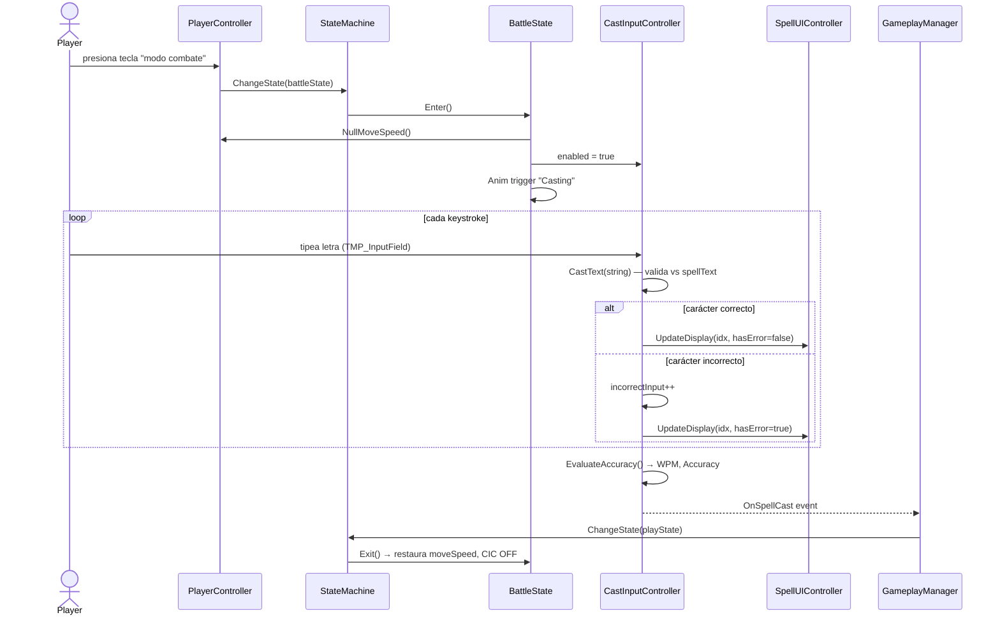

---

## 8. Diagrama de Secuencia — Game Over

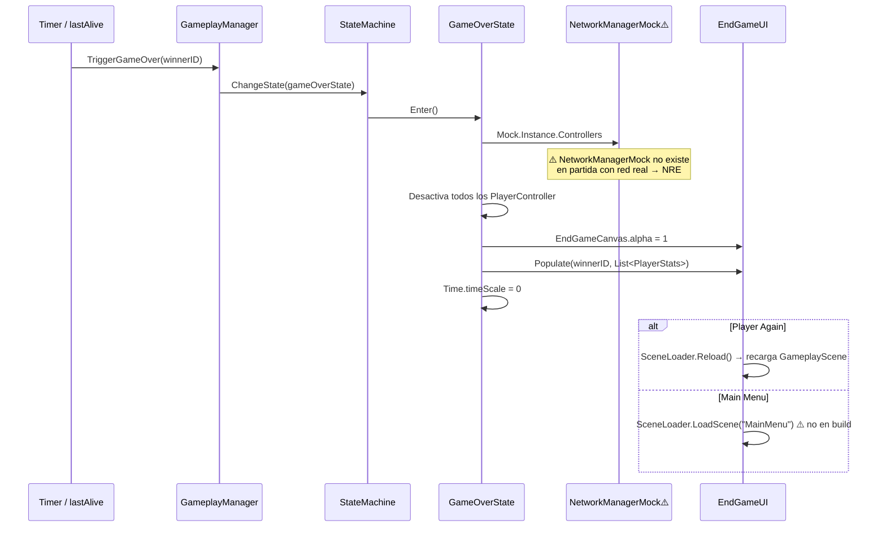

---

## 9. Diagrama de Componentes — Arquitectura

```mermaid
flowchart TB
    subgraph Persistent["Singletons DontDestroyOnLoad"]
        SF[ScreenFader]
        GM[GameManager<br/>+ InGameTimer]
        IPH[IPHolder]
        SC[SelectController]
        AM[AudioManager - stub]
    end

    subgraph Lobby["LobbyScene"]
        LC[LobbyController]
        LUI[LobbyUIController]
        NMC[NetworkManagerConfigurator]
        IPV[IPValidator]
    end

    subgraph CharSel["CharacterSelect"]
        CSC[CharacterSelectController]
        SC2[SelectController instance]
        IDC[IDController - per player<br/>NetworkBehaviour]
    end

    subgraph Gameplay["GameplayScene"]
        GPM[GameplayManager<br/>scene singleton]
        SMx[StateMachine]
        PC[PlayerController]
        CC[CameraController]
        CIC[CastInputController]
        SUI[SpellUIController]
        HUD[HUDController]
        Pause[PauseController]
        Resp[RespawnController]
        MS[MonolithSpawn]
        Mono[MonolithView/Controller]
        PIV[PlayerInteractorView]
        EUI[EndGameUI]
        Anim[PlayerAnimatorView]
        ELbl[EnemyLabel]
        LP[LaunchPad]
    end

    subgraph Network["Unity Netcode"]
        NM[NetworkManager.Singleton]
        UTP[UnityTransport]
        NPC[NetworkPlayerController]
    end

    subgraph Data["Datos / SO"]
        PS[PlayerStats]
        MD[MonolithData]
        SD[SpellData / Spell]
        SI[SkinInfo]
        CD[CharacterData]
        ADB[AudioDataBase]
    end

    LC --> NM
    NMC --> NM
    CSC --> NM
    CSC --> SC
    IDC --> SC
    SC --> IDC
    GPM --> NM
    GPM --> SMx
    GPM --> PC
    GPM --> CIC
    GPM --> EUI
    PC --> CC
    PC --> SMx
    CIC --> SUI
    HUD --> PS
    Resp --> PC
    MS --> Mono
    PIV --> Mono
    Mono --> SD
    SUI --> SD
    GPM --> SI
    AM --> ADB

    classDef stub fill:#fff3cd,stroke:#856404;
    class AM stub
```

---

## 10. Diagrama de Secuencia — Bootstrap Completo (resumen)

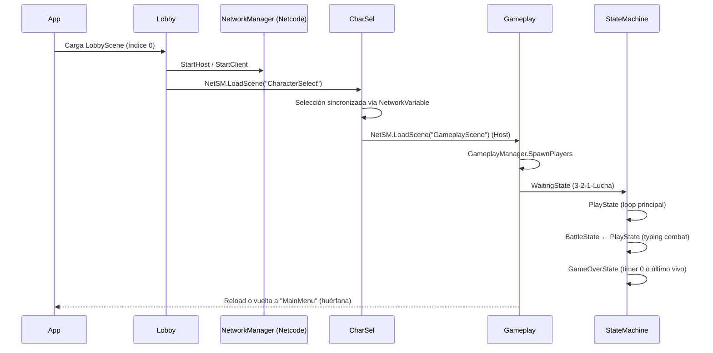
