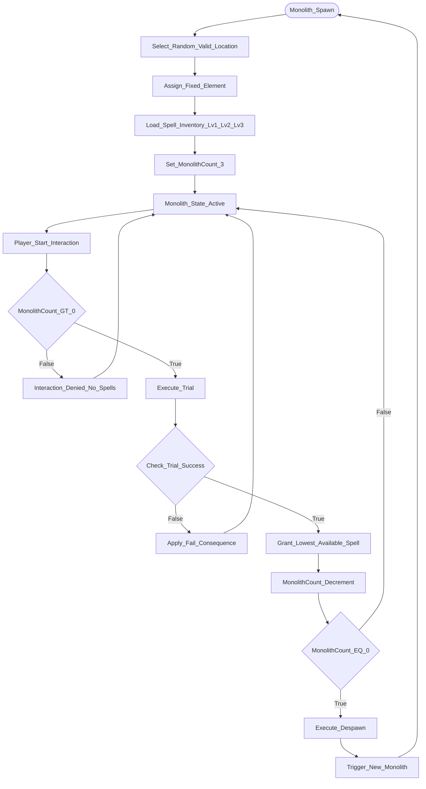

```mermaid
flowchart TD

A([Monolith_Spawn]) --> B[Select_Random_Valid_Location]
B --> C[Assign_Fixed_Element]
C --> D[Load_Spell_Inventory_Lv1_Lv2_Lv3]
D --> E[Set_MonolithCount_3]
E --> F[Monolith_State_Active]

F --> G[Player_Start_Interaction]
G --> H{MonolithCount_GT_0}

H -- False --> Z[Interaction_Denied_No_Spells]
Z --> F

H -- True --> I[Execute_Trial]
I --> J{Check_Trial_Success}

J -- False --> K[Apply_Fail_Consequence]
K --> F

J -- True --> L[Grant_Lowest_Available_Spell]
L --> M[MonolithCount_Decrement]
M --> N{MonolithCount_EQ_0}

N -- False --> F

N -- True --> O[Execute_Despawn]
O --> P[Trigger_New_Monolith]
P --> A
```