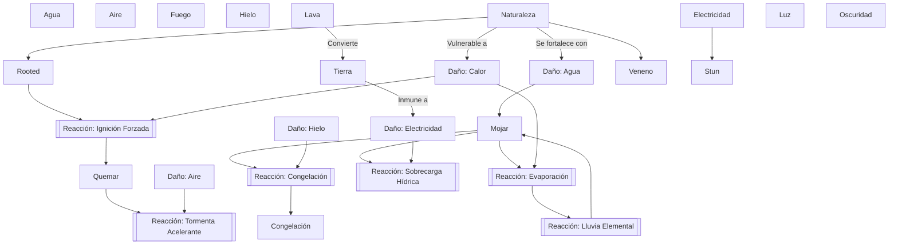

```mermaid
flowchart TD

%% =========================
%% ELEMENTOS
%% =========================

T[Tierra]
Ag[Agua]
Ai[Aire]
F[Fuego]
Hi[Hielo]
El[Electricidad]
La[Lava]
Na[Naturaleza]
Lu[Luz]
Os[Oscuridad]

%% =========================
%% TIPOS DE DAÑO
%% =========================

D_Agua[Daño: Agua]
D_Aire[Daño: Aire]
D_Calor[Daño: Calor]
D_Elec[Daño: Electricidad]
D_Hielo[Daño: Hielo]

%% =========================
%% STATUS EFFECTS
%% =========================

S_Mojar[Mojar]
S_Quemar[Quemar]
S_Congelar[Congelación]
S_Rooted[Rooted]
S_Veneno[Veneno]
S_Stun[Stun]

%% =========================
%% REACCIONES
%% =========================

R_Congelacion[[Reacción: Congelación]]
R_Ignicion[[Reacción: Ignición Forzada]]
R_Sobrecarga[[Reacción: Sobrecarga Hídrica]]
R_Evaporacion[[Reacción: Evaporación]]
R_Lluvia[[Reacción: Lluvia Elemental]]
R_Tormenta[[Reacción: Tormenta Acelerante]]

%% =========================
%% APLICACIÓN DE STATUS
%% =========================

D_Agua --> S_Mojar
Na --> S_Rooted
Na --> S_Veneno
El --> S_Stun

%% =========================
%% REACCIONES PRINCIPALES
%% =========================

S_Mojar --> R_Congelacion
D_Hielo --> R_Congelacion
R_Congelacion --> S_Congelar

S_Rooted --> R_Ignicion
D_Calor --> R_Ignicion
R_Ignicion --> S_Quemar

S_Mojar --> R_Sobrecarga
D_Elec --> R_Sobrecarga

S_Mojar --> R_Evaporacion
D_Calor --> R_Evaporacion

R_Evaporacion --> R_Lluvia
R_Lluvia --> S_Mojar

S_Quemar --> R_Tormenta
D_Aire --> R_Tormenta

%% =========================
%% INTERACCIONES ESPECIALES
%% =========================

La -->|Convierte| T
Na -->|Se fortalece con| D_Agua
T -->|Inmune a| D_Elec
Na -->|Vulnerable a| D_Calor
```