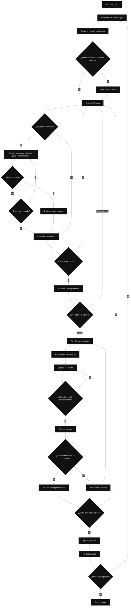

```mermaid
---
config:
  layout: dagre
  theme: redux-dark
---
flowchart TB
    A["Inicio del juego"] --> B["Seleccion de 4 personajes"]
    B --> C["Spawn en el centro del mapa"]
    C --> D{"¿Interactuar con el monolito central?"}
    D -- Sí --> E["Elegir hechizo inicial"]
    D -- No --> F["Explorar el mapa"]
    E --> F
    F --> G{"¿Encuentra un monolito?"}
    G -- Sí --> H["Intentar prueba de escritura para obtener hechizo"]
    H --> J{"¿Supera la prueba?"}
    J -- Sí --> K["Obtiene nuevo hechizo"]
    J -- No --> L{"¿Reintentar la prueba?"}
    L -- Sí --> H
    L -- No --> I["Continuar explorando"]
    K --> I
    G -- No --> I
    I --> M{"¿Encuentra a otro jugador?"}
    M -- Sí --> N["Encuentro entre jugadores"]
    M -- No --> F
    N --> C1{"¿Qué decide el jugador?"}
    C1 -- Evitar combate --> F
    C1 -- Atacar --> C2["Abrir libro de hechizos"]
    C2 --> C3["Elegir hechizo disponible"]
    C3 --> C4["Escribir el hechizo"]
    C4 --> C5{"¿Hechizo escrito correctamente?"}
    C5 -- No --> C4
    C5 -- Sí --> C6["Castear hechizo"]
    C6 --> C7{"¿El hechizo derrota al oponente?"}
    C7 -- Sí --> P["Jugador enemigo eliminado"]
    C7 -- No --> C8["El combate continúa"]
    C8 --> C2
    P --> R{"¿Queda más de un jugador?"}
    R -- Sí --> F
    R -- No --> S["Jugador ganador"]
    S --> U["Fin de la partida"]
    U --> V{"¿Iniciar nueva partida?"}
    V -- Sí --> B
    V -- No --> W["Salir del juego"]


```