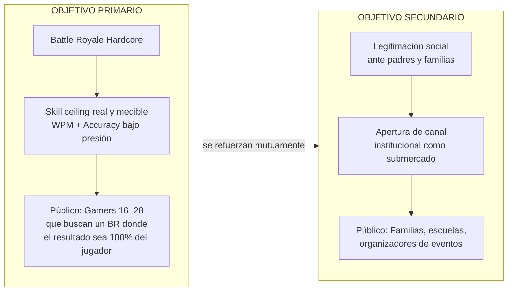
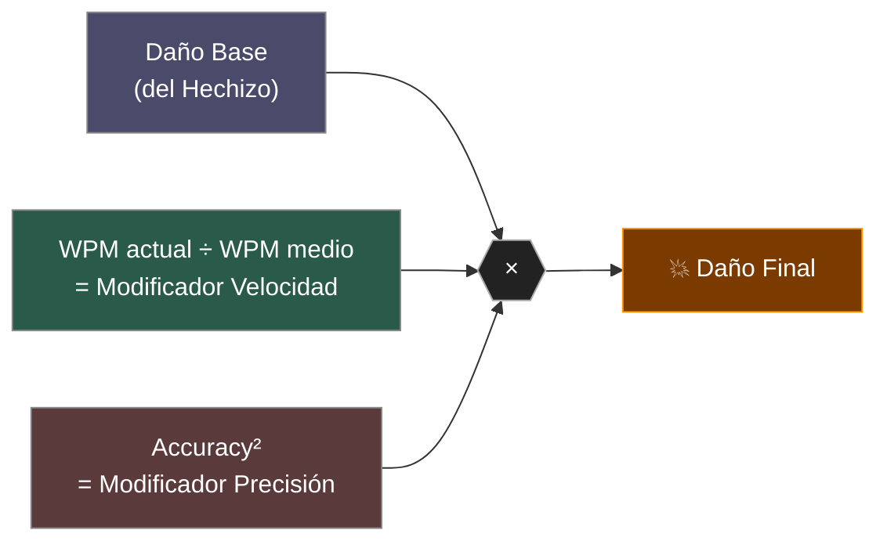
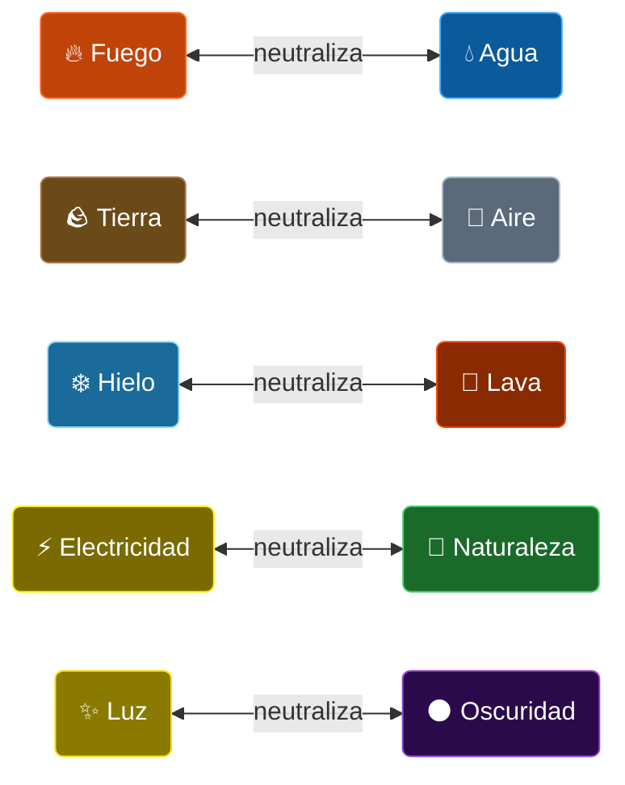
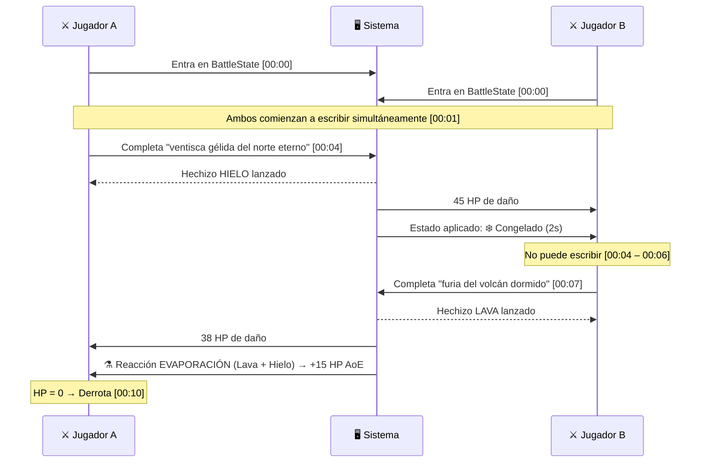
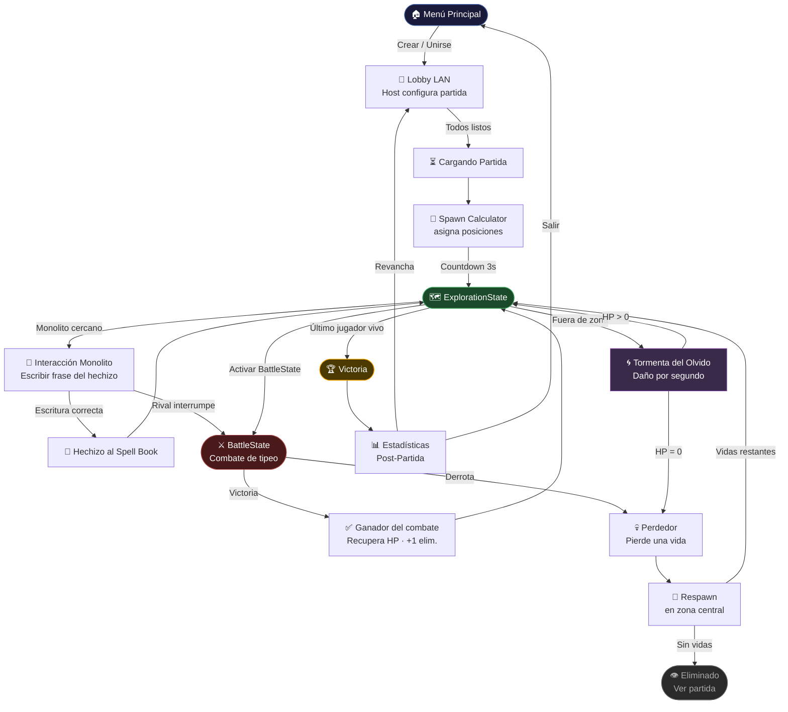
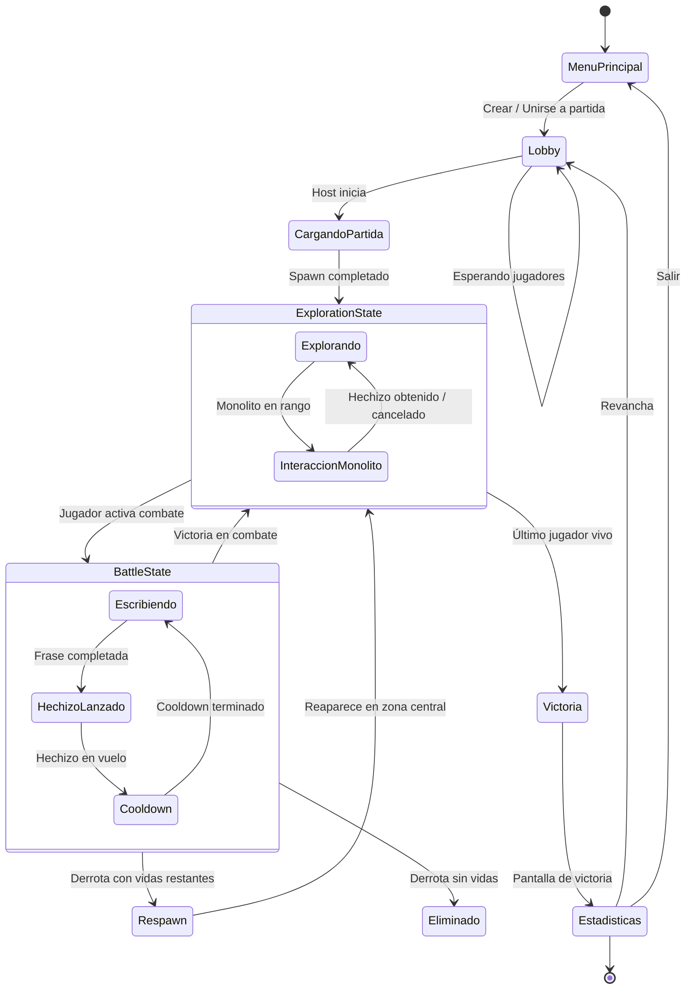
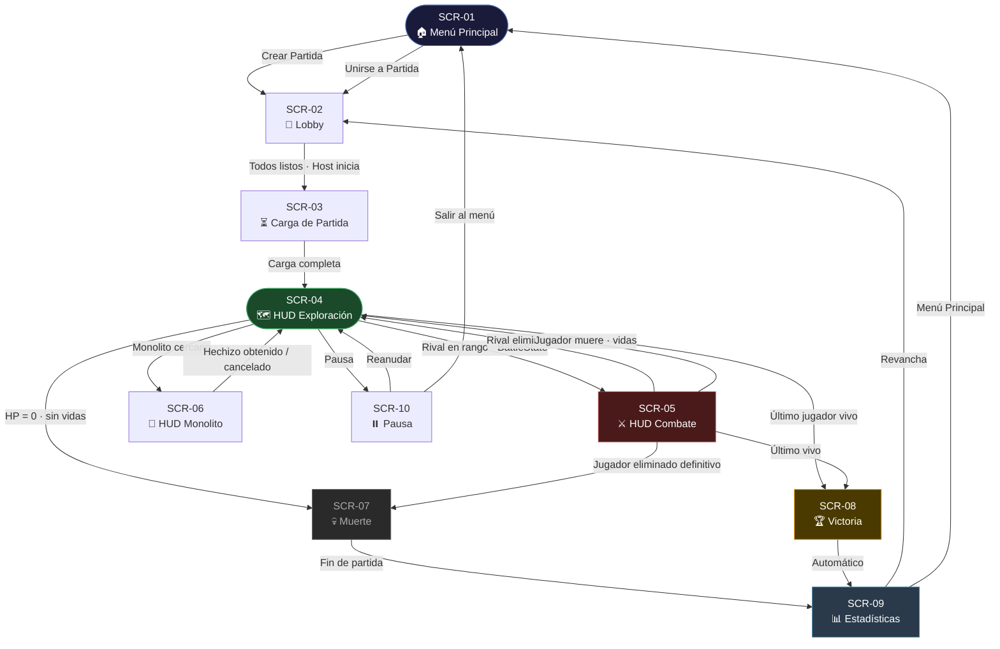

# Keyboard Battle Royale (Temp Name) — Documento Funcional
**Versión:** 1.0 | **Fecha:** Marzo 2026 | **Estado:** MVP en Desarrollo

> Este documento centraliza la visión funcional completa del juego *Keyboard Battle Royale*. Está redactado como documento de presentación para estudios o inversores interesados en co-desarrollar, publicar o adquirir la propiedad intelectual del título. Para referencias técnicas específicas de implementación, consultar los documentos en `_documents/Core/` y `_documents/Planning/Dev/`.

---

## Tabla de Contenidos

1. [Definición del Juego](#1-definición-del-juego)
2. [Lore y Universo](#2-lore-y-universo)
3. [Personajes](#3-personajes)
4. [Jugabilidad Core](#4-jugabilidad-core)
5. [Sistema de Magia Elemental](#5-sistema-de-magia-elemental)
6. [Interacción entre Jugadores](#6-interacción-entre-jugadores)
7. [Game Loop Completo](#7-game-loop-completo)
8. [Arquitectura de Pantallas y Flujo de UI](#8-arquitectura-de-pantallas-y-flujo-de-ui)
9. [Entorno y Mundo de Juego](#9-entorno-y-mundo-de-juego)
10. [Monetización y Mercado Objetivo](#10-monetización-y-mercado-objetivo)

---

## 1. Definición del Juego

### 1.1 Concepto Central

**Keyboard Battle Royale** (temp) es un **Battle Royale de tipeo competitivo**. Su primer alcance es un desarrollo en partidas locales LAN de hasta **N jugadores simultáneos**. Los jugadores encarnan magos que compiten en una arena dividida en biomas. La única arma disponible es el **teclado**: los hechizos se lanzan escribiendo frases en tiempo real. La velocidad, precisión y elección táctica determinan quién sobrevive.

El juego fusiona dos géneros de forma inédita:
- La **tensión y reducción del espacio** propias del Battle Royale.
- La **mecánica de habilidad pura** del typing competitivo (WPM / Accuracy).

No existe puntería manual, no existen reflejos de reacción inmediata. La única habilidad que importa es **escribir bien y rápido bajo presión**.

### 1.2 Plataforma y Modo de Juego

| Parámetro | Valor |
|---|---|
| Plataforma | PC (Windows) |
| Modo | Multijugador LAN local |
| Jugadores | Mínimo 2, óptimo 4–8 |
| Perspectiva | Primera persona (FPS) |
| Engine | Unity 3D con URP |
| Arte | Low Poly / Cell Shading / Toon Comedic |

### 1.3 Propuesta de Valor Única

> "El único Battle Royale del mundo donde tu velocidad de tipeo es literalmente tu daño."

El juego ocupa un nicho de mercado sin competencia directa. Ningún título existente combina:
- Mecánica Battle Royale
- Los jugadores tienen varias vidas (2 a 3) por partida.
- Tipeo como sistema de combate principal
- Progresión de hechizos dentro de la partida
- Modo LAN ideal para torneos presenciales y aulas

**Competidores parciales analizados:** Typeracer (sin combate), NitroType (sin Battle Royale), Magicka (sin tipeo), Fall Guys (sin habilidad técnica), KeyWe (casual, cooperativo). **Ninguno replica la propuesta actual.**

---

### 1.4 Objetivos Estratégicos de Posicionamiento

El juego no es un programa educativo. No pretende serlo. Su objetivo primario es ser un **Battle Royale que se gana siendo mejor que los demás** — y la única forma de ser mejor es escribir más rápido y con más precisión. Sin atajos, sin ventajas de equipo, sin pay-to-win.

De esta premisa se derivan dos objetivos estratégicos que amplían el mercado de forma natural:

#### Objetivo 1 — Diferenciación Hardcore

Los Battle Royale actuales (Fortnite, PUBG, Warzone) enfrentan un problema de saturación: el público hardcore percibe que el skill ceiling está limitado por factores externos al jugador (ping, equipo, azar del loot). El juego propone un escenario radicalmente distinto:

> **El único factor que determina el resultado es lo que tú eres capaz de hacer con tus dedos.**

No hay RNG en el combate. No hay lag que justifique una derrota. No hay builds que nivelar semanas antes. Si perdiste, fue porque el otro jugador escribió más rápido. Eso genera una de las dinámicas más adictivas del diseño de juegos: la responsabilidad total del resultado. El jugador hardcore no puede culpar a nada externo — y eso lo hace volver a intentarlo.

La curva de aprendizaje es real, medible (WPM, accuracy) y visible. El jugador puede ver su progresión partida a partida. Eso es exactamente lo que busca el gamer competitivo.

#### Objetivo 2 — Justificación de Uso (El Argumento del Padre de Familia)

El segundo objetivo no es educativo en sí mismo: es una **palanca de legitimación social** del juego.

Un Battle Royale estándar no tiene argumento ante un padre que pregunta "¿para qué sirve que juegues eso?". El juego sí tiene respuesta: **mejorar la mecanografía es una consecuencia directa e inevitable de jugar**. No porque el juego lo declare, sino porque la mecánica central lo exige. Para ganar hay que escribir mejor. Para escribir mejor hay que practicar. La práctica ocurre jugando.

Esto no convierte al juego en un curso. Lo convierte en **el único Battle Royale donde los padres pueden decir "sí"** sin mentirse a sí mismos. La justificación no está en el marketing del juego hacia jugadores — está en el argumento que el jugador puede usar ante su entorno.

El efecto secundario de este posicionamiento es la apertura de un submercado institucional (escuelas, aulas, laboratorios de cómputo) donde el juego puede venderse como herramienta con métricas reales. Pero ese mercado es consecuencia, no causa.

#### Síntesis del Posicionamiento



Estos dos objetivos no compiten: se refuerzan. El juego más difícil del género también resulta ser el que tiene el mejor argumento externo. Esa combinación es la base de su potencial comercial.

---

## 2. Lore y Universo

### 2.1 Contexto del Mundo

En el mundo de **Arcanis**, el conocimiento mágico no reside en la sangre ni en la fuerza bruta, sino en la **Palabra Arcana**: la capacidad de invocar conjuros mediante la recitación precisa y veloz de sus fórmulas. Los magos no lanzan hechizos con un gesto; los *escriben* en el aire con energía pura, letra por letra, runa por runa.

Desde hace generaciones, los magos de Arcanis se congregan en **El Gran Torneo del Teclado**, un rito sagrado y espectáculo de masas donde los contendientes prueban la supremacía de su conocimiento arcano. El torneo se celebra en arenas dispersas por los biomas más extremos del mundo —desde glaciares helados hasta cañones que aúllan con vientos mágicos— para asegurarse de que los hechiceros se enfrenten tanto a sus rivales como al entorno.

### 2.2 Los Monolitos Arcanos

Dispersos por la arena existen los **Monolitos Arcanos**: antiguos pilares de piedra que contienen hechizos sellados de gran poder. Un mago que interactúa con un monolito debe superar una **Prueba Arcana** —escribir correctamente la fórmula del hechizo contenido—. Si lo logra, el conocimiento del monolito pasa a su Libro de Hechizos y el monolito se desvanece, dejando solo un rastro de energía elemental.

Los monolitos son la clave de la escalada de poder dentro de la partida. Un mago que domine los monolitos dominará el combate.

### 2.3 La Tormenta del Olvido

Como todo Battle Royale que se respeta, el escenario se contrae con el tiempo. En WotK, la contracción del mapa se explica diegéticamente como **La Tormenta del Olvido**: una perturbación mágica que consume el conocimiento y la materia de las zonas que abandona. Los magos que quedan atrapados en la tormenta sienten cómo su poder se disuelve, perdiendo vida de forma continua hasta que perecen o escapan a la zona segura.

### 2.4 Tono Narrativo

El universo adopta un tono **toon-comedic**: serio en su mecánica, pero irreverente y exagerado en su estética. Los magos son figuras caricaturescas con siluetas expresivas; los hechizos provocan reacciones físicas exageradas (congelación instantánea, electrocución con pelos de punta, lava derritiendo armaduras). El mundo tiene peso narrativo pero nunca se toma demasiado en serio a sí mismo y se puede ver en los mismos hechizos. Los textos para conjugar elementos tienen un tono irreverente, elocuente, gracioso y sin sentido.

---

## 3. Personajes

### 3.1 Filosofía de Diseño de Personajes

Los personajes siguen tres pilares de diseño visual:
1. **Siluetas exageradas y reconocibles** — cada mago debe ser identificable en cualquier condición de iluminación o distancia.
2. **Claridad de lectura** — los arquetipos elemental/de clase son visibles en el diseño sin necesidad de leer texto.
3. **Humor físico** — proporciones exageradas, gestos amplios, reacciones cómicas.

Paleta de colores máxima: 4 colores base por personaje, con 1 color de acento para identificación de equipo o hechizo activo. Texturizado en atlas compartido (2048×2048 máximo), 2–3 materiales por personaje.

### 3.2 Arquetipo Base: El Mago Hechicero

Para el MVP existe un **arquetipo de mago genérico** que sirve como base jugable. Este personaje tiene:
- **Libro de Hechizos** visible en mano (prop animado que se abre al entrar en combate).
- **Aura elemental** que cambia de color según el último hechizo equipado.
- **Animaciones de estado:** Idle, Caminar, Pose de Combate, Apertura del Libro, Muerte.

### 3.3 Diferenciación Visual por Elemento

Aunque en el MVP todos los jugadores comparten el mismo modelo base, el hechizo activo debe modificar visualmente al libro, baculo, mano o algun elemento visible de primera persona. Se puede tomar como una referencia los tonicos que se usan en la saga de Bioshock. En seguida se enlistan los elementos disponibles en el universo:

| Elemento | Color Aura | Efecto Visual |
|---|---|---|
| Fuego | Naranja / Rojo | Llamas en los bordes del libro |
| Agua | Azul / Cian | Burbujas y destellos acuosos |
| Tierra | Marrón / Verde oscuro | Partículas de tierra y gravilla |
| Aire | Blanco / Gris plateado | Trazos de viento y polvo |
| Hielo | Azul hielo / Blanco | Cristales flotantes |
| Electricidad | Amarillo / Azul eléctrico | Chispas y arcos |
| Lava | Naranja / Negro | Goteo de magma |
| Naturaleza | Verde / Dorado | Hojas y esporas |
| Luz | Blanco puro / Dorado | Halos y destellos brillantes |
| Oscuridad | Morado / Negro | Sombras y partículas de vacío |


## 4. Jugabilidad Core

### 4.1 El Loop de Dos Estados

El corazón del juego reside en la alternancia entre dos estados de juego:

#### Estado de Exploración
El jugador se mueve libremente por el mapa en **primera persona** usando WASD para desplazarse. Durante este estado:
- Puede explorar el entorno buscando Monolitos Arcanos.
- Puede acercarse a otros jugadores para iniciar combate.
- Puede leer el mapa para anticipar la contracción de la tormenta.
- **No puede lanzar hechizos activamente** — el Libro de Hechizos está cerrado.
- Puede tener un analisis de la situacion actual, cuantos personajes quedan vivos.

El movimiento es fluido, basado en `CharacterController` de Unity con gravedad simulada. La cámara sigue un modelo de primera persona con rotación por mouse.

#### Estado de Combate (Tipeo)
Cuando dos jugadores se encuentran dentro del **rango de combate**, ambos pueden seleccionar cambiar al **Modo Combate**:
- El movimiento se detiene y la camara se alinea automaticamente al enemigo. (si es que lo hay)
- En el caso de no encontrar a nadie, se debe ver visualmente que no hay jugadores y la camara mirara de frente.
- El **Libro de Hechizos se abre** con animación. Mostrando los hechizos usados recientes.
- En pantalla aparece la interfaz de tipeo: la frase del hechizo activo que se debera presionar y un input de texto.
- El jugador escribe la frase para lanzar el hechizo, visualmente vera reflejado su accuracy.
- El jugador podra terminar antes la frase, enviando un hechizo incompleto que no hara el mismo daño.
- El hechizo conjurado hara daño segun el accuracy y la velocidad.
- Los hechizos enviados son autoguiados al jugador de enfrente.
- En caso de haber mas de dos jugadores enfrentandose se podra seleccionar entre que jugador atacar.

El bloqueo de movimiento es intencional y tiene como objetivo crear **tensión táctica** (¿entro al rango del rival fuerte o rodeo?), **legibilidad** (el espectador sabe quién está en combate) y **pureza mecánica** (ganará quien mejor escriba, no quien mejor haga kiting).

### 4.2 El Sistema de Tipeo

El motor de tipeo es el núcleo técnico y de diseño del juego. Sus reglas:

**Validación carácter a carácter:** Cada tecla presionada es evaluada en tiempo real. Si es correcta, avanza el cursor. Si es incorrecta, se marca el error y el carácter permanece hasta ser corregido.

**Métricas calculadas:**
- **WPM (Palabras Por Minuto):** Velocidad de escritura en tiempo real.
- **Accuracy (Precisión):** Porcentaje de caracteres correctos sobre el total presionado.

**Fórmula de daño:**



Esta fórmula garantiza que un jugador que escribe rápido pero con errores **no sea invencible**: la penalización de accuracy actúa como cuadrado, castigando duramente los errores. Un jugador lento pero preciso puede competir contra uno rápido y descuidado.

**Corrección de errores:** El jugador puede usar Backspace para corregir. Cada error cometido (incluso si se corrige) penaliza el accuracy final del hechizo.

**Spell Completion:** Al escribir el último carácter del hechizo correctamente, se dispara automáticamente el hechizo hacia el objetivo.

### 4.3 El Libro de Hechizos

Cada jugador gestiona un **Spell Book** (Libro de Hechizos):
- Comienza la partida sin ningun hechizo, todos los magos deberan ir a buscarlos.
- Puede desbloquear hasta **N hechizos adicionales** interactuando con Monolitos.
- Solo puede obtener **1 hechizo** por monolito.
- Podra buscar sus hechizos en su libro, sin embargo, esto consume tiempo de combate.

El diseño del Spell Book crea **decisiones tácticas pre-combate**: ¿equipo el hechizo de alto daño con frase larga y difícil, o el de daño medio con frase corta y confiable? ¿Cambio de elemento para explotar la debilidad del rival que veo acercarse?

### 4.4 Cooldowns y Recursos

Los hechizos tienen **tiempo de recarga (cooldown)** después de ser lanzados. Durante el cooldown, el jugador en combate debe esperar o alternar a otro hechizo del Spell Book si lo tiene disponible. Esto evita el spam de hechizos y premia la gestión del Spell Book.

No existen puntos de maná: el único recurso es el tiempo de cooldown. La economía de la partida se basa en **tiempo**, **salud** y **conocimiento** (hechizos desbloqueados).

---

## 5. Sistema de Magia Elemental

### 5.1 Estructura de Elementos

El sistema elemental de WotK es profundo y modular. Se organiza en tres capas:

#### Elementos Fundamentales (4)
La base de toda magia. Son los átomos del sistema:

| Elemento | Daño | Estado de Efecto |
|---|---|---|
| **Tierra** | Físico | Raíz (Rooted) — inmoviliza brevemente |
| **Agua** | Hídrico | Mojado (Wet) — amplifica daño eléctrico/hielo |
| **Aire** | Cinético | Empuje — desplaza al rival |
| **Fuego** | Térmico | Quemado (Burning) — DoT de daño continuo |

#### Elementos Compuestos (4)
Combinaciones de dos elementos fundamentales. Son más poderosos y sus frases de hechizo son más largas/difíciles:

| Elemento | Composición | Efecto Especial |
|---|---|---|
| **Hielo** | Agua + Tierra | Congelado (Frozen) — inmovilización prolongada |
| **Electricidad** | Aire + Agua | Stun eléctrico; +daño si objetivo está Mojado |
| **Lava** | Fuego + Tierra | Conversión de superficie, daño por área |
| **Naturaleza** | Agua + Tierra | Regeneración propia + veneno en rival |

#### Elementos Definitivos (2)
Los elementos más raros, obtenibles solo de Monolitos de alto nivel:

| Elemento | Descripción |
|---|---|
| **Luz** | Elimina estados negativos propios. Daño puro irresistible. |
| **Oscuridad** | Aplica múltiples estados negativos simultáneos. Alto riesgo/recompensa. |

### 5.2 Reacciones Elementales

El sistema de reacciones es el corazón de la profundidad táctica. Cuando un elemento interactúa con un estado de efecto activo en el objetivo, se produce una reacción que amplifica o modifica el resultado:

| Reacción | Condición | Resultado |
|---|---|---|
| **Congelación** | Hielo sobre objetivo Mojado | Congelación extendida (2× duración) |
| **Ignición** | Fuego sobre objetivo Mojado | Vapor: AoE térmico + elimina Wet |
| **Sobrecarga** | Electricidad sobre objetivo Mojado | Stun amplificado + daño masivo |
| **Evaporación** | Fuego sobre Hielo | Destruye Frozen, AoE de vapor |
| **Lluvia Ácida** | Agua sobre Quemado | Cancela Burning, aplica DoT ácido |
| **Tormenta** | Electricidad + Lluvia Ácida | Tempest: AoE eléctrico de gran radio |
| **Erupción** | Lava sobre Hielo | Explosión térmica masiva |
| **Simbiosis** | Naturaleza sobre Tierra | Regeneración acelerada, Rooted propio |

### 5.3 Inversión Elemental

Cada elemento tiene un **Elemento Inverso** que lo neutraliza o contrarresta:



Cuando se lanza el elemento inverso sobre un estado activo, este se cancela. Esta mecánica permite **estrategias de counter** y añade una capa de lectura del rival: si sabes qué elemento tiene equipado el oponente, puedes preparar el counter antes del combate.

---

## 6. Interacción entre Jugadores

### 6.1 Inicio de Combate

El combate entre dos jugadores se inicia de forma **manual por cambio de estado**. En cualquier momento un mago puede entrar en modo combate. En este estado el sistema entra en un modo **auto aim** en un rango de 10 metros. Cualquier jugador puede seleccionar salir de este estado y huir, con el riesgo de ser atacado por la espalda.

Los ataques de espalda tienen una mayor probabilidad de ser criticos (10%).

### 6.2 Resolución de Combate

El combate no es por turnos: ambos jugadores **escriben simultáneamente**. El primero en completar su frase lanza el hechizo. Después del cooldown, ambos pueden volver a escribir, o si tienen mas hechizos pueden seguir conjurando. Esto incita a la caza de hechizos, ya que quien mas hechizos tenga puede hacer mas DPS.

**Ejemplo de secuencia de combate:**



### 6.3 Consecuencias del Combate

**Jugador derrotado:**
- Muere en el lugar (animación de muerte/ragdoll).
- Tiene una vida menos y hace un respawn con su misma cantidad de hechizos.
- Respawnea en el centro del mapa, ahi los hechizos no son efectivos.
- La posición de los hechizos son visibles brevemente en el minimapa como indicador de zona de peligro.

**Jugador victorioso:**
- Recupera un porcentaje de HP.
- Suma 1 punto de eliminación al marcador.
- Si el rival tenía un hechizo de nivel 3, puede aparecer un Monolito como recompensa (mecánica de loot post-combate, expansión futura).

### 6.4 Interacción con Monolitos

La interacción con Monolitos Arcanos sigue el mismo motor de tipeo del combate:

1. El jugador en exploración se acerca a un Monolito hasta el **Radio de Interacción**.
2. El HUD muestra un indicador y la opción de interactuar.
3. Al confirmar presionando un boton, el jugador escribe la **frase del hechizo contenido** en el monolito.
4. Si la escritura es correcta, el hechizo se añade al Spell Book.
5. A diferencia del combate, en los monolitos las frases deben completarse completamente.
6. El monolito desaparece con efecto VFX de liberación de energía.
7. Si otro jugador interrumpe (entra al radio de combate mientras el primero interactúa), la interacción se cancela y comienza el combate.

Este diseño crea **puntos de conflicto natural**: los monolitos son objetivos de valor que atraen a múltiples jugadores, generando encuentros en zonas específicas del mapa. Varios personajes pueden desbloquear en el mismo monolito. Por lo que se pueden robar hechizos si es que uno escribe mas rapido que el otro. Los monolitos solo tienen 3 niveles de hechizos. Cada nivel es mas dificil que el anterior, al ser mas dificiles su daño tambien es mayor.

Un jugador no podra desbloquear mas de un hechizo por monolito. Los monolitos desapareceran despues de un cierto tiempo o al ser obtenidos todos los hechizos de estos.

### 6.5 HUD de Combate e Información Visual

Durante el combate, el HUD muestra a ambos jugadores:
- **Barra de HP** propia y del rival (con número exacto).
- **Frase del hechizo activo** con cursor de posición actual.
- **Indicadores de error** (caracteres incorrectos resaltados en rojo).
- **Cooldown restante** del hechizo.
- **Icono elemental** del hechizo propio y rival.
- **Estados de efecto activos** (íconos de Burning, Frozen, etc.) propios y del rival.

---

## 7. Game Loop Completo

### 7.1 Fase Pre-Partida

El jugador crea o se une a un lobby LAN. El Host configura la partida (tamaño de arena, número de jugadores). Los jugadores confirman "Listo" y el Host inicia cuando todos están preparados.

### 7.2 Fase de Inicio de Partida

La escena de arena carga, el Spawn Calculator distribuye los jugadores en puntos equidistantes. Tras un countdown de 3 segundos, todos entran en ExplorationState y el timer de la partida arranca.

### 7.3 Fase de Exploración y Escalada

Los jugadores exploran libremente en busca de Monolitos Arcanos para armar su Spell Book. Los monolitos de Tier superior aparecen en zonas de mayor riesgo. La Tormenta del Olvido se contrae progresivamente.

### 7.4 Fase de Combate

Cuando un jugador activa el BattleState, el sistema auto-apunta al rival más cercano en rango. El combate es de tipeo simultáneo. El vencedor recupera HP; el derrotado pierde una vida y respawnea.

### 7.5 Fase Final

Cuando queda un único jugador vivo, se muestra la pantalla de Victoria y las estadísticas completas de la partida. Los jugadores pueden solicitar revancha o volver al menú.

### 7.6 Diagrama Completo del Game Loop



### 7.7 Diagrama de Estados del Sistema



---

## 8. Arquitectura de Pantallas y Flujo de UI

### 8.1 Inventario de Pantallas

| ID | Pantalla | Descripción |
|---|---|---|
| SCR-01 | Menú Principal | Punto de entrada al juego |
| SCR-02 | Pantalla de Lobby | Sala de espera pre-partida |
| SCR-03 | Carga de Partida | Transición de lobby a arena |
| SCR-04 | HUD de Exploración | Interfaz durante movimiento libre |
| SCR-05 | HUD de Combate | Interfaz durante el tipeo de combate |
| SCR-06 | HUD de Monolito | Interfaz al interactuar con monolito |
| SCR-07 | Pantalla de Muerte | Feedback al jugador eliminado |
| SCR-08 | Pantalla de Victoria | Pantalla del ganador |
| SCR-09 | Pantalla de Estadísticas | Post-partida, resumen completo |
| SCR-10 | Pantalla de Pausa | Pausa in-game (solo host en MVP) |

### 8.2 Flujo de Navegación entre Pantallas



### 8.4 SCR-01: Menú Principal

**Elementos UI:**
- Logo de *Keyboard Battle Royale*
- Botón "Crear Partida" (inicializa como Host)
- Botón "Unirse a Partida" (lista de lobbies LAN disponibles)
- Botón "Opciones" (audio, resolución, sensibilidad)
- Botón "Salir"

**Flujo:** Crear → SCR-02 como Host | Unirse → Lista de Lobbies → SCR-02 como Client

### 8.5 SCR-02: Pantalla de Lobby

**Elementos UI:**
- Lista de jugadores conectados (nombre, estado: Esperando/Listo)
- Indicador de slots disponibles (e.g., "3/8 jugadores")
- Panel de configuración de partida (solo visible para Host):
  - Tamaño de arena
  - Número máximo de jugadores
- Botón "Listo" (todos los jugadores)
- Botón "Iniciar" (solo Host, habilitado cuando todos están listos)

**Flujo:** Todos listos + Host inicia → SCR-03

### 8.6 SCR-03: Carga de Partida

**Elementos UI:**
- Pantalla de carga con barra de progreso.
- Tip del juego aleatorio (mecánicas, lore, estrategias).
- Preview artístico del bioma de la arena.

**Flujo:** Carga completa para todos los jugadores → SCR-04

### 8.7 SCR-04: HUD de Exploración

**Diseño:** Minimalista para no obstaculizar la visión en primera persona.

**Elementos UI:**
- **Centro:** Crosshair dinámico (cambia de forma al enfocar un Monolito o rival)
- **Esquina superior izquierda:** Barra de HP con número exacto
- **Esquina superior derecha:** Minimapa con zona segura (radio) y posición de jugadores
- **Esquina inferior izquierda:** Icono del hechizo activo + nombre
- **Esquina inferior derecha:** Timer de partida + contador de jugadores vivos
- **Centro-superior:** Indicador de zona segura (si el jugador está en zona peligrosa: barra roja y tiempo restante)
- **Dinámico:** Hit markers cuando el jugador recibe daño de tormenta

**Flujo desde SCR-04:**
- Encuentro con rival → SCR-05
- Acercarse a Monolito → SCR-06
- HP llega a 0 → SCR-07
- Último jugador vivo → SCR-08

### 8.8 SCR-05: HUD de Combate

**Diseño:** Ocupa el tercio inferior de la pantalla. Los elementos del HUD de Exploración permanecen visibles en los márgenes.

**Elementos UI (área de tipeo):**
- **Panel central-inferior:** Frase del hechizo activo con tipografía monoespaciada de alta legibilidad
  - Caracteres ya escritos correctamente: color verde/blanco
  - Carácter actual (cursor): resaltado/subrayado
  - Caracteres pendientes: color gris
  - Error (carácter incorrecto): color rojo, fondo de error
- **Sobre el panel:** Nombre e icono del hechizo activo (ej: "Ventisca Gélida | Hielo")
- **Lado izquierdo del panel:** HP propio + icono elemental propio
- **Lado derecho del panel:** HP rival + nombre del rival + icono elemental rival
- **Bajo el panel:** Barra de cooldown del hechizo
- **Efectos de estado:** Iconos flotantes sobre ambas barras de HP indicando estados activos (Burning, Frozen, etc.)

**Retroalimentación visual:**
- Al cometer un error: vibración leve del panel + flash rojo
- Al completar el hechizo: flash brillante + animación de lanzamiento en primera persona
- Al recibir daño: vignette roja en bordes de pantalla + número de daño flotante

**Flujo desde SCR-05:**
- Rival muere → vuelta a SCR-04
- Jugador propio muere → SCR-07
- Último jugador vivo → SCR-08

### 8.9 SCR-06: HUD de Interacción con Monolito

**Diseño:** Similar a SCR-05 pero con estética distinta (más "ritual/mística").

**Elementos UI:**
- **Centro:** Descripción del hechizo contenido en el monolito (nombre, elemento, daño estimado)
- **Panel de tipeo:** Idéntico al de combate, con la frase del hechizo a desbloquear
- **Progreso:** Barra de avance de escritura
- **Advertencia:** Si se detecta un rival acercándose, aparece un indicador parpadeante de peligro ("¡Intruso Detectado!")

**Flujo:** Escritura completada → hechizo añadido a Spell Book → vuelta a SCR-04

### 8.10 SCR-07: Pantalla de Muerte

**Diseño:** Overlay sobre la cámara en primera persona congelada en el punto de muerte.

**Elementos UI:**
- Texto central: "Eliminado por [Nombre del rival]"
- Estadísticas de la partida hasta el momento (eliminaciones, WPM promedio, accuracy)
- Opción de ver el juego continuar (spectator mode — expansión futura)
- Countdown a SCR-09 (estadísticas finales)

### 8.11 SCR-08: Pantalla de Victoria

**Diseño:** Cinemática breve + overlay.

**Elementos UI:**
- Animación del personaje ganador (pose de victoria)
- Texto: "¡Victoria! El Conocimiento Arcano es Tuyo"
- Estadísticas destacadas: WPM máximo alcanzado, accuracy promedio, eliminaciones
- Transición automática a SCR-09

### 8.12 SCR-09: Pantalla de Estadísticas

**Diseño:** Tabla de clasificación completa.

**Elementos UI:**
- Ranking de jugadores (1.º al último eliminado)
- Por cada jugador:
  - Nombre
  - Eliminaciones
  - WPM promedio
  - Accuracy promedio
  - Hechizos completados / intentados
  - Monolitos reclamados
  - Elemento más usado
- Botón "Revancha" (crea nuevo lobby con mismos jugadores)
- Botón "Menú Principal"

---

## 9. Entorno y Mundo de Juego

### 9.1 Filosofía de Diseño del Entorno

El mapa de WotK es una **arena de combate diseñada para el conflicto natural**, no una exploración abierta. Cada bioma tiene:
- **Obstáculos visuales** que rompen las líneas de visión y crean emboscadas.
- **Puntos de control** (Monolitos) en ubicaciones estratégicas.
- **Rutas naturales** que concentran el tráfico de jugadores.

El arte de bajo polígono es tanto estético como funcional: permite una lectura clara del espacio en partidas rápidas y caóticas.

### 9.2 Los Biomas del Mapa

El mundo de WotK incluye 3 zonas bioma, cada una con sus propias estructuras y puntos de interés:

| Zona | Descripción | Tipo de Obstáculos | Monolitos Típicos |
|---|---|---|---|
| **Cañón Aullante** | Cañón desertico con vientos fuertes repletos de polvo de mteorito | Paredes de roca, materia oscura, restos de dios| Aire, Electricidad|
| **Bosque Bananil** | Selva surrealista con árboles de gran escala con un pueblo estilo americano | Troncos masivos, raíces | Naturaleza, Tierra|
| **Bahía de Mlimbri** | Costa con estructuras estilo lovecraft sobre el agua | Puentes, pilares | Agua, Lava |

### 9.3 Lógica de Spawn y Distribución

El **Spawn Calculator** es un sistema algorítmico que garantiza:
1. **Distribución equidistante** de jugadores al inicio de la partida (nadie spawneará adyacente a un rival).
2. **Evitación de zonas centrales calientes** al inicio (los jugadores spawneean en los bordes del mapa para dar tiempo de exploración).
3. **Asignación determinista** basada en el número de jugadores y la geometría del mapa.

Los Monolitos se distribuyen con:
- 60% en zonas periféricas (accesibles temprano, hechizos Tier 1).
- 30% en zonas medias (requieren travesía, hechizos Tier 2).
- 10% en zona central/peligrosa (alto riesgo, hechizos Tier 3 y Definitivos).

---

## 10. Monetización y Mercado Objetivo

### 10.0 Resumen Ejecutivo

El juego es un Battle Royale multijugador LAN que convierte la mecanografía en la única arma de combate. No es un programa educativo ni lo pretende — es un videojuego competitivo diseñado para el jugador hardcore que lleva años frustrado con Battle Royales donde el resultado depende del azar, el equipo o el meta.

Su diferenciador comercial tiene dos capas:

**Capa 1 — Diferenciación competitiva:** El skill ceiling es una habilidad real y medible (WPM + accuracy). No hay RNG, no hay ventajas de loot, no hay disparidad de builds. Esto atrae al segmento hardcore que los BR actuales han dejado insatisfecho.

**Capa 2 — Legitimación social:** Como consecuencia directa de su mecánica, jugar mejora la mecanografía. Esto no es el argumento de venta hacia jugadores — es el argumento que el jugador usa con sus padres, y el vector que abre un submercado institucional (escuelas, laboratorios, eventos) sin comprometer la identidad hardcore del producto.

---

### 10.1 Segmentos de Mercado Primarios

#### 10.1.1 Gamer Competitivo Casual — El Núcleo

| Atributo | Descripción |
|---|---|
| **Edad** | 16 – 28 años |
| **Perfil** | Jugadores que disfrutan sesiones cortas e intensas en grupos |
| **Plataforma habitual** | PC (escritorio / laptop) |
| **Géneros afines** | Battle Royale (Fortnite, PUBG), Party Games (Among Us, Fall Guys), Rogue-like |
| **Motivación principal** | Ganar frente a amigos, demostrar habilidad, revancha rápida |
| **Conexión con el juego** | El loop de partida corta (4 jugadores, sesión de ~10–15 min) y el humor visual *Toon-Cómico* replican exactamente el ritmo de los *party games* competitivos más exitosos del mercado |

**Por qué compra:** Es el mismo público que llena torneos de LAN party y maratones de juego en universidades. La barrera de entrada es baja (solo necesita saber escribir), pero el *skill ceiling* (WPM + precisión bajo presión) genera diferenciación y rejugabilidad.

#### 10.1.2 Comunidad de Typing — El Fan Inesperado

| Atributo | Descripción |
|---|---|
| **Edad** | 14 – 35 años |
| **Perfil** | Usuarios de plataformas como MonkeyType, Typeracer, Keybr, NitroType |
| **Motivación principal** | Mejorar WPM, competir contra otros, validar su habilidad |
| **Tamaño estimado** | MonkeyType supera los 4M de usuarios registrados (2024); NitroType +15M cuentas estudiantiles |
| **Conexión con el juego** | El juego es el primer *typing game* con consecuencias tácticas reales: errar una letra en combate tiene el mismo peso que fallar un disparo. Esto eleva el *typing competitivo* de pasatiempo a **deporte de habilidad** |

**Por qué compra:** Este segmento ya tiene la habilidad desarrollada. El juego les da un escenario donde esa habilidad tiene *stakes* reales y una audiencia (los otros 3 jugadores en la misma sala).

#### 10.1.3 Estudiante de Nivel Medio Superior y Superior — El Canal Institucional (Submercado)

> **Nota de posicionamiento:** Este segmento es un submercado derivado, no el público objetivo principal. La mecánica del juego produce mejora de mecanografía como efecto secundario inevitable — eso lo hace atractivo para instituciones, pero el juego no debe presentarse ante jugadores como una herramienta educativa. Es un Battle Royale. El argumento educativo es para el canal de venta institucional, no para el jugador.

| Atributo | Descripción |
|---|---|
| **Edad** | 15 – 22 años |
| **Contexto** | Preparatorias técnicas, universidades con laboratorio de cómputo |
| **Pain point** | Cursos de mecanografía percibidos como aburridos y anticuados |
| **Motivación del jugador** | Competir, ganar, superar a sus compañeros |
| **Motivación de la institución** | El juego genera métricas reales de WPM y accuracy sin necesidad de software especializado |
| **Conexión con el juego** | Requiere LAN, funciona sin internet, y cada partida produce datos de desempeño de tipeo por jugador. Eso lo hace operable en laboratorio de cómputo escolar sin fricción técnica |

**Por qué compra (institución):** Licencia de aula para múltiples estaciones. El argumento de venta a la institución es eficiencia: los alumnos practican mecanografía activamente porque quieren ganar, no porque sea obligatorio.

#### 10.1.4 Organizadores de Eventos — El Canal de Experiencia

| Atributo | Descripción |
|---|---|
| **Perfil** | Organizadores de LAN parties, torneos universitarios, ferias tecnológicas, convenciones de videojuegos (e.g., Expo Aula, ComicCon CDMX) |
| **Necesidad** | Juegos que funcionen offline, escalen fácilmente a múltiples mesas, sean accesibles para jugadores nuevos pero entretenidos para el público observador |
| **Conexión con el juego** | La pantalla visible del libro de hechizos y el *feedback* visual de hechizos lanzados hacen el combate **legible como espectáculo**. El público no necesita jugar para entender quién va ganando |

**Por qué compra:** Licencia de evento o licencia de sala. Alto valor de exhibición en demostraciones públicas.

---

### 10.2 Segmentos Secundarios

#### 10.2.1 Familia con Hijos en Edad Escolar

| Atributo | Descripción |
|---|---|
| **Edad del tomador de decisión** | 30 – 45 años (padre/madre) |
| **Edad del jugador** | 8 – 14 años |
| **Motivación** | Contenido sin violencia gráfica, que desarrolle habilidades reales |
| **Conexión con el juego** | La estética *Toon-Cómica* (inspirada en Brawl Stars y Wind Waker) y la ausencia de sangre o contenido adulto lo posicionan como un juego **apto para toda la familia**. El desarrollo de mecanografía es un argumento de venta directo para los padres |

#### 10.2.2 Desarrollador Independiente / Estudio Pequeño (Adquisición por IP)

| Atributo | Descripción |
|---|---|
| **Perfil** | Publishers o estudios buscando IPs con mecánica innovadora para escalar |
| **Interés** | El sistema de *Typing Combat* (validación en tiempo real, multiplicador de daño por WPM, hechizos por niveles) es una mecánica propietaria portable a otros géneros: RPG, tower defense, coop PvE |
| **Conexión con el juego** | El MVP demuestra la mecánica en el contexto más exigente posible (PvP competitivo). Una IP con una mecánica central validada tiene mayor valor de adquisición que una IP puramente narrativa |

---

### 10.3 Geografía

#### Mercado Primario — México y LATAM
- **México** concentra la mayor base de LAN parties universitarios de la región.
- Las preparatorias técnicas (CONALEP, CECyT) representan un canal institucional de millones de estudiantes con laboratorio de cómputo existente.
- El precio accesible para licencias regionales en LATAM es un diferenciador frente a títulos AAA.

#### Mercado Secundario — Hispanohablantes Globales
- EE.UU. hispano (40M de hispanohablantes), España y el resto de América Latina.
- El idioma del contenido de hechizos (textos en español) refuerza el aprendizaje ortográfico en mercados hispanohablantes, siendo un argumento de valor adicional.

#### Mercado Terciario — Global (Expansión)
- Con localización de la base de datos de hechizos a otros idiomas, el modelo es replicable globalmente.
- El segmento *typing community* es internacional y altamente conectado digitalmente.

---

### 10.4 Competencia y Posicionamiento

| Título | Similitud | Diferencia vs el juego |
|---|---|---|
| **Typeracer** | Typing competitivo multijugador | Sin componente táctico ni ambientación. Plano, sin historia |
| **NitroType** | Typing con progresión | Enfocado en niños, sin PvP real ni mecánica de combate |
| **Magicka 1 & 2** | Fantasía cómica, hechizos combinados | Sin typing; mayor complejidad de control; precio AAA |
| **Fall Guys** | Party game competitivo, tono cómico | Sin habilidad transferible al mundo real |
| **KeyWe** | Typing cooperativo en minijuegos | Sin Battle Royale ni escalabilidad competitiva |

**Conclusión:** No existe en el mercado actual un título que combine Battle Royale competitivo + typing como mecánica central + estética accesible. El juego ocupa un nicho no disputado.

---

### 10.5 Propuesta de Valor por Segmento

```
Gamer Competitivo  →  "El teclado es tu arma. Quien escribe más rápido, gana."
Comunidad Typing   →  "Por fin, tu WPM tiene consecuencias reales."
Canal Educativo    →  "Mecanografía gamificada. Métricas reales. Aulas encendidas."
Evento / LAN       →  "Fácil de montar, imposible de ignorar como espectáculo."
Familia            →  "Divertido, seguro y educativo. Ganas si sabes escribir."
```

---

### 10.6 Modelo de Distribución Recomendado

| Canal | Formato | Precio Sugerido (USD) |
|---|---|---|
| **Steam / itch.io** | Licencia individual | $4.99 – $9.99 |
| **Licencia de Aula** | 1 licencia para 30 estaciones | $49 – $99 |
| **Licencia de Evento** | Uso temporal en feria/torneo | $29 por evento |
| **Bundle Educativo** | Acuerdo con institución o SEP | Negociación directa |
| **Adquisición de IP** | Venta de mecánica + código fuente | A valorar post-demo |

---

### 10.7 Indicadores de Tracción Esperados (Post-Demo Day)

- **Sesiones promedio:** 3–5 partidas por sesión (loop corto, alta rejugabilidad).
- **Retención:** Alta en segmento competitivo por asimetría de habilidad (siempre hay alguien más rápido a quien superar).
- **Viralidad orgánica:** El humor visual y los momentos de "fallo épico" (errar un hechizo en el momento decisivo) son altamente compartibles en redes sociales.
- **Argumento educativo:** WPM medible por sesión → métricas concretas para propuestas institucionales.

---

### 10.8 Resumen de Oportunidad

El juego es el primer Battle Royale donde la única ventaja competitiva es una habilidad del mundo real: escribir bien y rápido bajo presión. Eso resuelve la frustración del gamer hardcore con los BR actuales y, como efecto colateral de su mecánica, produce el único argumento genuino que convierte a un videojuego competitivo en algo que un padre no puede rebatir.

No es un juego educativo disfrazado de entretenimiento. Es un Battle Royale que, por diseño, te hace mejor escribiendo. La diferencia es fundamental: el primero vende una obligación, el segundo vende una victoria.

> **La oportunidad:** nicho competitivo no disputado + legitimación social orgánica + submercado institucional como vector secundario = una IP con múltiples vectores de monetización desde su primer MVP, sin comprometer su identidad de producto.

---

## Apéndices y Referencias

Este documento centraliza la visión funcional del proyecto. Para profundización técnica y de diseño, consultar los siguientes documentos del repositorio:

| Documento | Ubicación | Contenido |
|---|---|---|
| Game Design Document | `_documents/GDD.md` | Visión artística, pilares de diseño |
| Sistema Elemental Completo | `_documents/GameDesign/Sistema Elemental y Magia/Elementos.md` | Todas las reacciones y reglas |
| Diagrama de Clases (Alto Nivel) | `_documents/Core/ClassDiagram.md` | Arquitectura de código MVC |
| Diagramas de Flujo de Combate | `_documents/Core/ClassAttack.md` | Flujo técnico del tipeo |
| Flujo del Game Loop | `_documents/Core/Flowchart.md` | Diagrama completo de estados |
| Diagrama ER | `_documents/Core/EntityRelationship.md` | Modelo de datos |
| Red y Networking | `_documents/Core/Network/Unity_Service.md` | Evaluación técnica de soluciones LAN |
| Zonificación del Mapa | `_documents/GameDesign/Environments/Diagrama_Zonificacion.md` | Mindmap de biomas |
| Tareas de Desarrollo | `_documents/Planning/Dev/DevTasks.md` | ~100 tareas de implementación |
| Roadmap de Desarrollo | `_documents/Planning/Dev/RoadMapDev.md` | Plan de 4 meses por células |
| Roadmap de Arte | `_documents/Planning/Artist/RoadMapArtist.md` | Pipeline artístico completo |
| Mercado Objetivo | `_documents/Planning/MercadoObjetivo.md` | Análisis de mercado detallado |

---

*Keyboard Battle Royale — © 2026 Amerike Dev Team. Documento de uso interno y presentación a terceros.*
